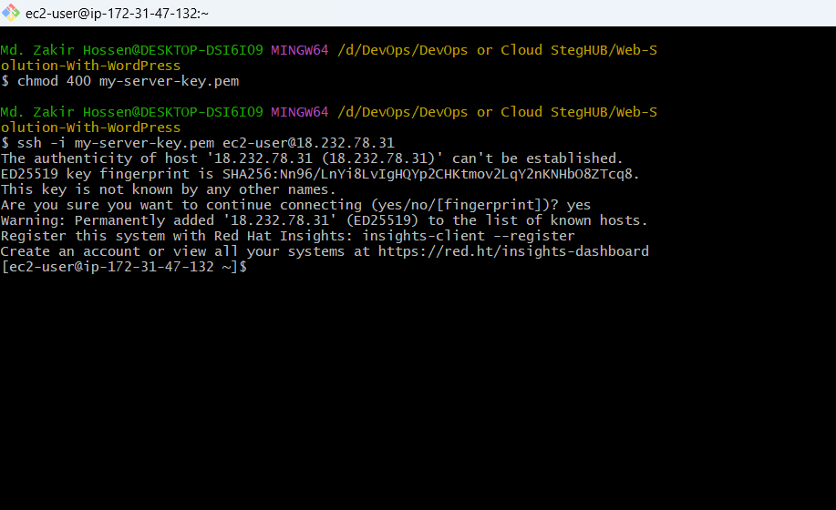
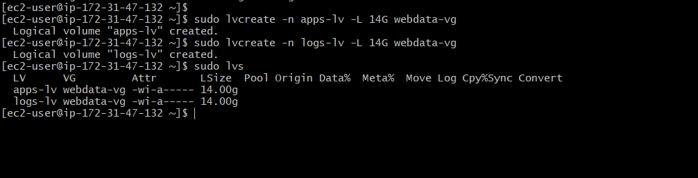
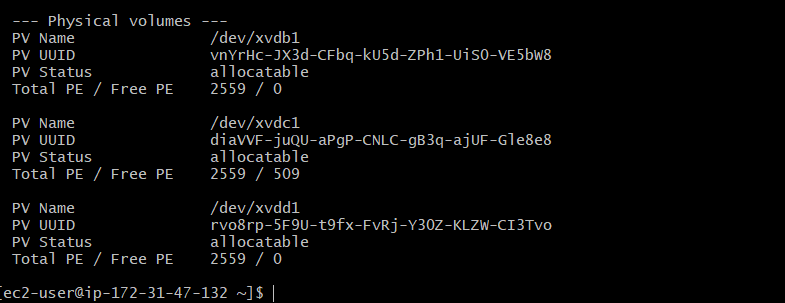
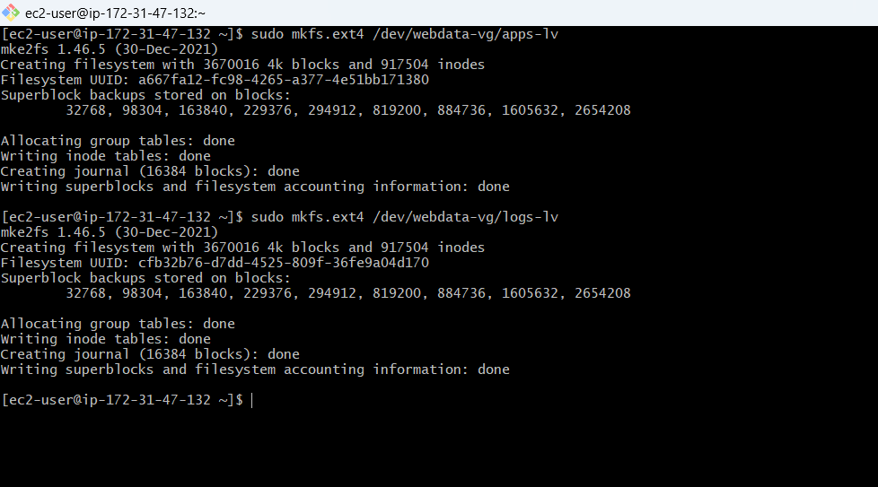
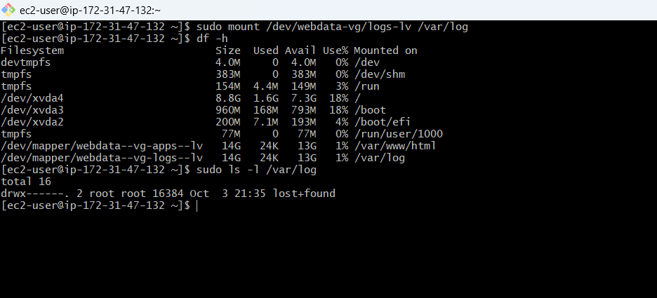
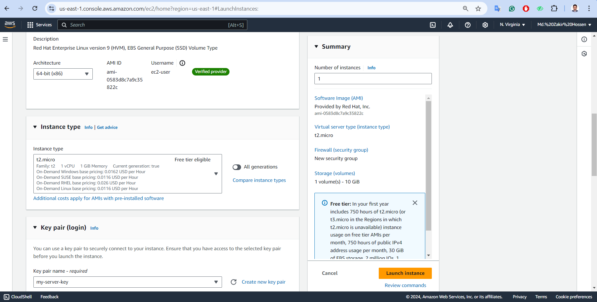
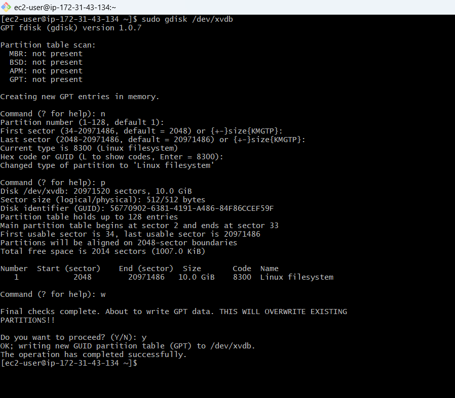
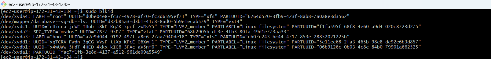
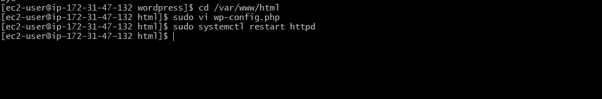

# Web Solution With WordPress
##  __Note:__ When attempting to install packages such as wget, httpd, php-fpm, and php-json, an error was encountered due to insufficient memory and CPU on the t2.micro instance (Web Server). To resolve this issue, the instance was migrated to a t2.medium instance, which provides higher memory and CPU capacity. I recommend ensuring that your EC2 instance has adequate resources to meet the official requirements of your specific project before deployment. Additionally, be mindful that when migrating to a different instance type, your public IP address may change, requiring updates to any relevant configurations.

## Step 1 - Prepare a Web Server

__1.__ __Launch a RedHat EC2 instance that serve as ```Web Server```. Create 3 volumes in the same AZ as the web server ec2 each of 10GB and attache all 3 volumes one by one to the web server__.


__2.__ __Open up the Linux terminal to begin configuration__.

```bash
chmod 400 my-server-key.pem
ssh -i "my-server-key.pem" ec2-user@18.232.78.31
```


__3.__ __Use ```lsblk``` to inspect what block devices are attached to the server. All devices in Linux reside in /dev/ directory. Inspect with ```ls /dev/``` and ensure all 3 newly created devices are there. Their name will likely be ```xvdb```, ```xvdc``` and ```xvdd```__.

```bash
lsblk
```


__4.__ __Use ```df -h``` to see all mounts and free space on the server__.

```bash
df -h
```


__5a.__ __Use ```gdisk``` utility to create a single partition on each of the 3 disks__.

```bash
sudo gdisk /dev/xvdb
```


```bash
sudo gdisk /dev/xvdc
```


```bash
sudo gdisk /dev/xvdd
```


__5b.__ __Use ```lsblk``` utility to view the newly configured partitions on each of the 3 disks__
```bash
lsblk
```


__6.__ __Install ```lvm``` package__
```bash
sudo yum install lvm2 -y
```


__7.__ __Use ```pvcreate``` utility to mark each of the 3 dicks as physical volumes (PVs) to be used by LVM. Verify that each of the volumes have been created successfully__.
```bash
sudo lvmdiskscan
sudo pvcreate /dev/xvdb1 /dev/xvdc1 /dev/xvdd1

sudo pvs
```


__8.__ __Use ```vgcreate``` utility to add all 3 PVs to a volume group (VG). Name the VG ```webdata-vg```. Verify that the VG has been created successfully__
```bash
sudo vgcreate webdata-vg /dev/xvdb1 /dev/xvdc1 /dev/xvdd1

sudo vgs
```


__9.__ __Use ```lvcreate``` utility to create 2 logical volume, ```apps-lv``` (__Use half of the PV size__), and ```logs-lv``` (__Use the remaining space of the PV size__). Verify that the logical volumes have been created successfully__.

__Note__: apps-lv is used to store data for the Website while logs-lv is used to store data for logs.
```bash
sudo lvcreate -n apps-lv -L 14G webdata-vg

sudo lvcreate -n logs-lv -L 14G webdata-vg

sudo lvs
```


__10a.__ __Verify the entire setup__
```bash
sudo vgdisplay -v   #view complete setup, VG, PV and LV
```



```bash
lsblk
```


__10b.__ __Use ```mkfs.ext4``` to format the logical volumes with ext4 filesystem__

```bash
sudo mkfs.ext4 /dev/webdata-vg/apps-lv

sudo mkfs.ext4 /dev/webdata-vg/logs-lv
```


__11.__ __Create ```/var/www/html``` directory to store website files and ```/home/recovery/logs``` to store backup of log data__
```bash
sudo mkdir -p /var/www/html

sudo mkdir -p /home/recovery/logs
```
#### Mount /var/www/html on apps-lv logical volume
```bash
sudo mount /dev/webdata-vg/apps-lv /var/www/html
```


__12.__ __Use ```rsync``` utility to backup all the files in the log directory ```/var/log``` into ```/home/recovery/logs``` (This is required before mounting the file system)__

```bash
sudo rsync -av /var/log /home/recovery/logs
```


__13.__ __Mount ```/var/log``` on ```logs-lv``` logical volume (All existing data on /var/log is deleted with this mount process which was why the data was backed up)__

```bash
sudo mount /dev/webdata-vg/logs-lv /var/log
```


__14.__ __Restore log file back into ```/var/log``` directory__
```bash
sudo rsync -av /home/recovery/logs/ /var/log
```


__15.__ __Update ```/etc/fstab``` file so that the mount configuration will persist after restart of the server__

#### Get the ```UUID``` of the device and Update the ```/etc/fstab``` file with the format shown inside the file using the ```UUID```. Remember to remove the leading and ending quotes.
```bash
sudo blkid   # To fetch the UUID
cat /etc/fstab

sudo vi /etc/fstab
sudo /etc/fstab
```


Before Eid & After Edit /etc/fstab showing


__16.__ __Test the configuration and reload daemon. Verify the setup__
```bash
sudo mount -a   # Test the configuration file /etc/fstab

sudo systemctl daemon-reload

df -h   # Verifies the setup
```


## Step 2 - Prepare the Database Server

### Launch a second RedHat EC2 instance that will have a role - ```DB Server```. Repeat the same steps as for the Web Server, but instead of ```apps-lv```, create ```dv-lv``` and mount it to ```/db``` directory.

__1.__ __Create 3 volumes in the same AZ as the ```DB Server``` ec2 each of 10GB and attache all 3 volumes one by one to the DB Server__.





__2.__ __Open up the Linux terminal to begin configuration__.

```bash
ssh -i "my-server-key.pem" ec2-user@3.85.78.146
```


__3.__ __Use ```lsblk``` to inspect what block devices are attached to the server. Their name will likely be ```xvdb```, ```xvdc``` and ```xvdd```__.

```bash
lsblk
```


__4a.__ __Use ```gdisk``` utility to create a single partition on each of the 3 disks__.

```bash
sudo gdisk /dev/xvdb
```


```bash
sudo gdisk /dev/xvdc
```


```bash
sudo gdisk /dev/xvdd
```


__4b.__ __Use ```lsblk``` utility to view the newly configured partitions on each of the 3 disks
```bash
lsblk
```


__5.__ __Install ```lvm``` package__
```bash
sudo yum install lvm2 -y
```


__6.__ __Use ```pvcreate``` utility to mark each of the 3 dicks as physical volumes (PVs) to be used by LVM. Also, use ```vgcreate``` utility to add all 3 PVs to a volume group (VG). Name the VG ```database-vg```. Verify that each of the volumes and the VG have been created successfully__.
```bash
sudo pvcreate /dev/xvdb1 /dev/xvdc1 /dev/xvdd1
sudo pvs
```
```bash
sudo vgcreate database-vg /dev/xvdb1 /dev/xvdc1 /dev/xvdd1
sudo vgs
```


__7.__ __Use ```lvcreate``` utility to create a logical volume, ```db-lv``` (__Use 20G of the PV size since it is the only LV to be created__). Verify that the logical volumes have been created successfully__.

```bash
sudo lvcreate -n db-lv -L 20G database-vg

sudo lvs
```


__8.__ __Use ```mkfs.ext4``` to format the logical volumes with ext4 filesystem and monut ```/db``` on ```db-lv```__

```bash
sudo mkfs.ext4 /dev/database-vg/db-lv
```
```bash
sudo mkdir /db
sudo mount /dev/database-vg/db-lv /db
```


__9.__ __Update ```/etc/fstab``` file so that the mount configuration will persist after restart of the server__

#### Get the ```UUID``` of the device

```bash
sudo blkid
```


#### Update the ```/etc/fstab``` file with the format shown inside the file using the ```UUID```. Remember to remove the leading and ending quotes.
```bash
sudo vi /etc/fstab
```


__10.__ __Test the configuration and reload daemon. Verify the setup__
```bash
sudo mount -a   # Test the configuration

sudo systemctl daemon-reload

df -h   # Verifies the setup
```


## Step 3 - Install WordPress on the Web Server EC2

__1.__ __Update the repository__
```bash
sudo yum -y update
```


__2.__ __Install wget, Apache and it's dependencies__
##  __Note:__ When attempting to install packages such as wget, httpd, php-fpm, and php-json, an error was encountered due to insufficient memory and CPU on the t2.micro instance. To resolve this issue, the instance was migrated to a t2.medium instance, which provides higher memory and CPU capacity.

Important: Please note that this migration has resulted in a change of the Public IP. Ensure that all necessary configurations, such as DNS settings or firewall rules, are updated to reflect the new IP address.


```bash
sudo yum -y wget httpd php-fpm php-json
```


__3.__ __Install the latest version of PHP and it's dependencies using the Remi repository__

#### Install the EPEL repository
The package manager ```dnf``` was used here.
It generally offers better performance and more efficient dependency resolution.
```dnf``` is the modern, actively maintained package manager, while yum is older and gradually being phased out.

#### The system version of the RHEL EC2 is version "9"

```bash
sudo dnf install https://dl.fedoraproject.org/pub/epel/epel-release-latest-9.noarch.rpm
```


#### Install yum utils and enable remi-repository

```bash
sudo dnf install dnf-utils http://rpms.remirepo.net/enterprise/remi-release-9.rpm
```


#### After the successful installation of yum-utils and Remi-packages, search for the PHP modules which are available for download by running the command.

```bash
sudo dnf module list php
```


#### The output above indicates that if the currently installed version of PHP is PHP 8.1, there is need to install the newer release, PHP 8.2. Reset the PHP modules.

```bash
sudo dnf module reset php
```


#### Having run reset, enable the PHP 8.2 module by running

```bash
sudo dnf module enable php:remi-8.2
```


#### Install PHP, PHP-FPM (FastCGI Process Manager) and associated PHP modules using the command.

```bash
sudo yum install php php-opcache php-gd php-curl php-mysqlnd -y
```


#### To verify the version installed to run.

```bash
php -v
```


#### Start, enable and check status of PHP-FPM on boot-up.

```bash
sudo systemctl start php-fpm
sudo systemctl enable php-fpm
sudo systemctl status php-fpm
```


__4.__ __Configure SELinux Policies__

To instruct SELinux to allow Apache to execute the PHP code via PHP-FPM run.

```bash
sudo chown -R apache:apache /var/www/html
sudo chcon -t httpd_sys_rw_content_t /var/www/html -R
sudo setsebool -P httpd_execmem 1
sudo setsebool -P httpd_can_network_connect=1
sudo setsebool -P httpd_can_network_connect_db=1
```

####  Restart Apache web server for PHP to work with Apache web server.

```bash
sudo systemctl restart httpd
```


#### Test to see the default Apache page on a browser using the public IP address

__Note__: Updated Public IP for ec2 migration: Follow the Previous Note


__5.__ __Download WordPress__

Download wordpress and copy wordpress content to /var/www/html

```bash
sudo mkdir wordpress && cd wordpress
sudo wget http://wordpress.org/latest.tar.gz
sudo tar xzvf latest.tar.gz   # Extract wordpress
```


#### After extraction, ```cd``` into the extracted ```wordpress``` and ```Copy``` the content of ```wp-config-sample.php``` to ```wp-config.php```.

This will copy and create the file wp-config.php

```bash
cd wordpress/
sudo cp -R wp-config-sample.php wp-config.php
```


#### Exit from the extracted ```wordpress```. Copy the content of the extracted ```wordpress``` to ```/var/www/html```.

```bash
cd ..
sudo cp -R wordpress/. /var/www/html/
```


__6.__ __Install MySQL on DB Server EC2__

#### Update the EC2
```bash
sudo yum update -y
```


#### Install MySQL Server
```bash
sudo yum install mysql-server -y
```


#### Verify that the service is up and running. If it is not running, restart the service and enable it so it will be running even after reboot.

```bash
sudo systemctl start mysqld
sudo systemctl enable mysqld
sudo systemctl status mysqld
```


__7.__ __Configure DB to work with WordPress__

#### Run mysql secure script

```bash
sudo mysql_secure_installation
```


#### Create database

The user "wordpress" will be connecting to the database using the Web Server __private IP address__

```bash
sudo mysql -u root -p

CREATE DATABASE wordpress_db;
CREATE USER 'wordpress'@'172.31.47.132' IDENTIFIED WITH mysql_native_password BY 'ZakirCmt$';
GRANT ALL PRIVILEGES ON wordpress_db.* TO 'wordpress'@'1172.31.47.132' WITH GRANT OPTION;
FLUSH PRIVILEGES;
show databases;
exit
```


#### Set the bind address

The bind address is set to the ```private IP address of the DB Server``` for more security instead of to any IP address (0.0.0.0)

```bash
sudo vi /etc/my.cnf
sudo systemctl restart mysqld
```


__8.__ __Configure WordPress to connect to remote database__

#### Open MySQL port 3306 on the DB Server EC2.
For extra security, access to the DB Server is allowed only from the Web Server IP address. In the inbound rule, /32 is configured as source.


#### Install mysql server on the Web Server EC2.

WordPress has its own database, therefore it needs a database server to store it's information such as: Username, Email, Passwords, First name and Last name of the users on the wordpress website on a database.

```bash
sudo yum install mysql-server -y
```


```bash
sudo systemctl start mysqld
sudo systemctl enable mysqld
sudo systemctl status mysqld
```


#### Open ```wp-config.php``` file and edit the database information

```bash
cd /var/www/html
sudo vi wp-config.php
sudo systemctl restart httpd
```


The ```private IP address``` of the DB Server is set as the ```DB_HOST``` because the DB Server and the Web Server resides in the same ```subnet``` which makes it possible for them to communicate directly. The private IP address is not an internet routable address.


#### Disable the Apache default page

Here the default page can be renamed.

```bash
sudo mv /etc/httpd/conf.d/welcome.conf /etc/httpd/conf.d/welcome.conf_backup
```


#### Connect to the DB Server from the Web Server

```bash
sudo mysql -h 172.31.43.134 -u wordpress -p

show databases;
exit;
```


#### Access the web page again with the Web Server public IP address and install wordpress on the browser


## At this point, the implementation of this project is complete and WordPress is available to be used.


